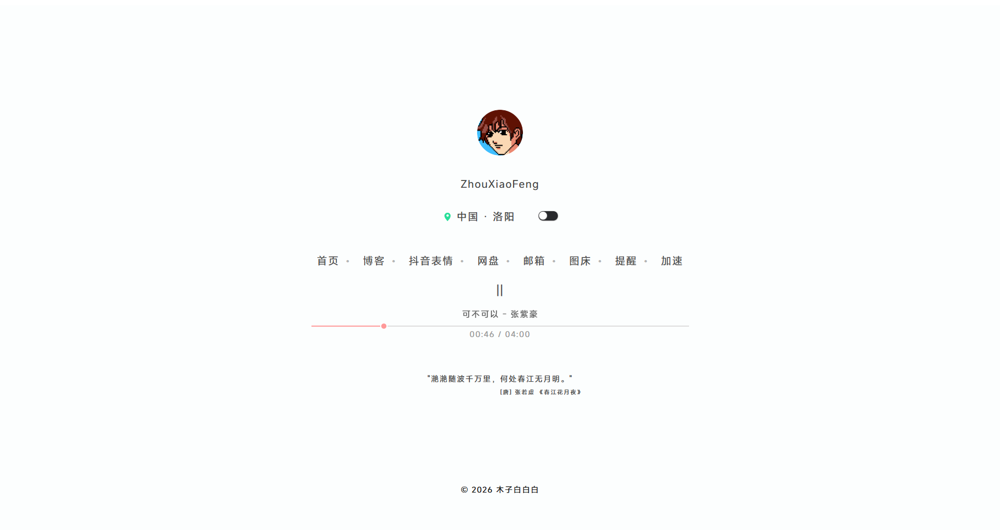
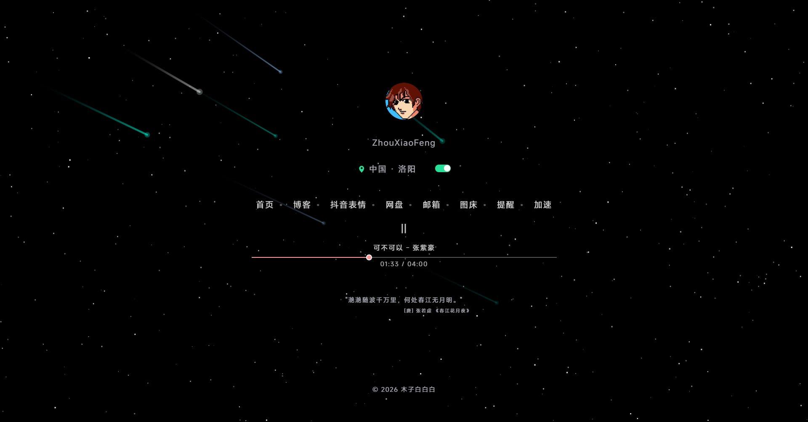
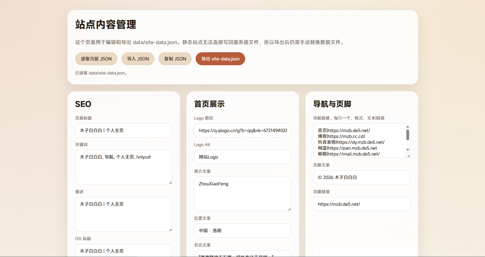

# 个人主页-V1

一个静态个人主页项目。首页内容从 `data/site-data.json` 读取，支持个人头像、简介、位置、导航链接、引用文案、页脚、SEO 信息和音乐播放器配置；同时提供 `admin.html` 用于可视化编辑并导出站点数据。

## 截图

<p align="center">
  
  
</p>

<p align="center">
  
</p>

## 功能

- 静态个人主页，适合部署到任意静态托管服务。
- 通过 `data/site-data.json` 统一管理站点标题、SEO、头像、简介、位置、导航、名言、播放器和页脚内容。
- 支持浅色 / 深色主题切换，并使用本地存储记住主题偏好。
- 深色模式下显示星空和流星画布动画，点击页面可触发流星效果。
- 内置音乐播放器，支持播放进度、时间显示和歌词解析。
- 提供 `admin.html` 管理页，可读取当前 JSON、导入 JSON、复制 JSON、导出 `site-data.json`。

## 目录结构

```text
.
├── index.html              # 首页入口
├── admin.html              # 站点内容管理页
├── data/
│   └── site-data.json      # 首页展示数据
├── css/
│   ├── main.css            # 全局样式
│   ├── APlayer.min.css     # 播放器样式
│   └── pages/
│       ├── home.css        # 首页样式
│       └── admin.css       # 管理页样式
├── js/
│   ├── APlayer.min.js      # 播放器脚本
│   ├── pages/
│   │   ├── home.js         # 首页渲染、播放器、星空动画
│   │   └── admin.js        # JSON 管理页逻辑
│   └── shared/
│       └── theme.js        # 主题切换逻辑
├── images/                 # 站点图标和本地图片资源
└── docs/images/            # README 截图
```

## 本地预览

项目会通过 `fetch('data/site-data.json')` 加载数据，建议使用本地 HTTP 服务预览，不要直接双击打开 HTML 文件。

```bash
python -m http.server 8080
```

然后访问：

```text
http://localhost:8080/
```

管理页访问：

```text
http://localhost:8080/admin.html
```

## 配置站点内容

主要修改 `data/site-data.json`：

| 字段 | 用途 |
| --- | --- |
| `seo` | 页面标题、关键词、描述和 Open Graph 信息 |
| `profile` | 头像地址、头像 Alt、首页简介 |
| `location` | 首页位置文案 |
| `nav` | 首页导航链接列表 |
| `quote` | 首页引用文案和署名 |
| `player` | 歌曲名称、作者、音频地址、歌词地址、封面地址 |
| `footer` | 页脚文字和链接 |

`admin.html` 可用于编辑这些字段。由于这是纯静态项目，管理页不会直接写回服务器文件；点击“导出 site-data.json”后，需要手动用导出的文件替换 `data/site-data.json`。

导航项在管理页中使用一行一个的格式：

```text
首页|https://example.com/
博客|https://blog.example.com/
```

## 部署

将项目根目录部署到静态托管环境即可，至少需要包含：

- `index.html`
- `admin.html`
- `data/`
- `css/`
- `js/`
- `images/`

如果不希望公开管理页，可以在部署时排除 `admin.html`，只保留本地用于生成 `data/site-data.json`。

## 校验清单

- `data/site-data.json` 是合法 JSON。
- `index.html` 能正常读取并渲染 `data/site-data.json`。
- 头像、音频、歌词、页脚和导航链接均可访问。
- 浅色 / 深色主题切换正常。
- 管理页导入、复制和导出 JSON 功能正常。

## 许可证

项目代码使用 [MIT License](./LICENSE) 开源。站点中引用的头像、音乐、歌词等外部资源版权归原权利方所有。
